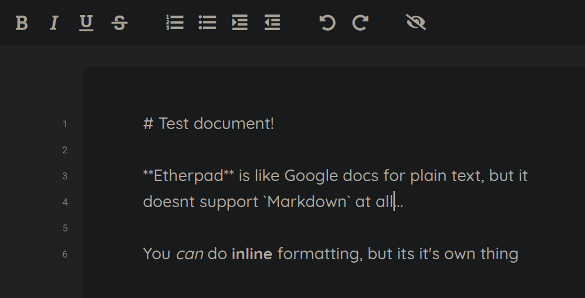
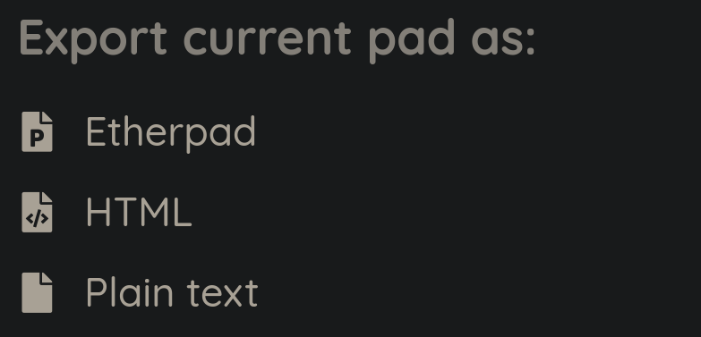
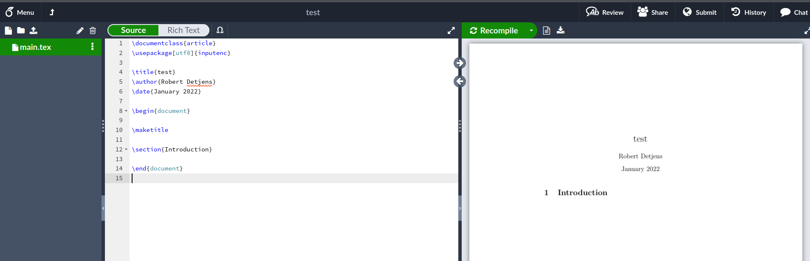
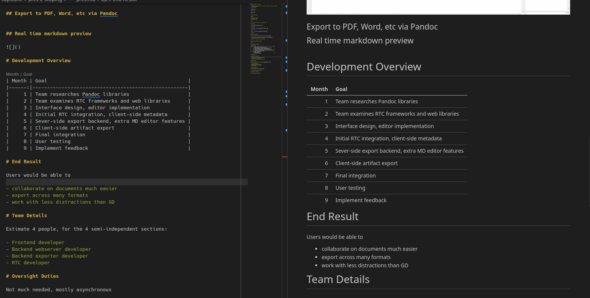

# Project overview

Pandoc

- document conversion
- markdown -> pdf
- easy and simple

but:

- not as easy to collab on as google docs

## Etherpad

## Etherpad

## Overleaf

# Vision

## Real time collab

Plain text editor with real time collab, like Etherpad

## Export to PDF, Word, etc via Pandoc

Dropdown menu

## Real time markdown preview

# Development Overview

| Month | Goal                                                |
|------:|-----------------------------------------------------|
|     1 | Team researches Pandoc libraries                    |
|     2 | Team examines RTC frameworks and web libraries      |
|     3 | Interface design, editor implementation             |
|     4 | Initial RTC integration, client-side metadata       |
|     5 | Sever-side export backend, extra MD editor features |
|     6 | Client-side artifact export                         |
|     7 | Final integration                                   |
|     8 | User testing                                        |
|     9 | Implement feedback                                  |

# End Result

Users would be able to

- collaborate on documents much easier
- export across many formats
- work with less distractions than GD

# Team Details

Estimate 4 people, for the 4 semi-independent sections:

- Frontend developer
- Backend webserver developer
- Backend exporter developer
- RTC developer

# Oversight Duties

Not much needed, mostly asynchronous

- satisfactory website design

# Necessary resources

- Site hosting (cheap VPS)

# In summary

- Pandoc, online
- Quick and easy document collab
- Easy export to several formats
