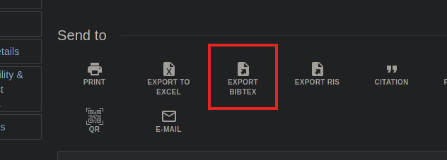
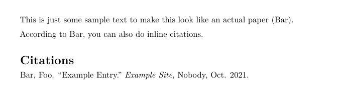

# Documents

PDF is inescapable.

## Word

{ height=60% }

## LibreOffice

{ height=60% }

## What if?

::: incremental
- Beautiful documents...
- without messing with formatting?
- that are `git` friendly?
- with minimal effort?
- and get more power when needed?
:::

## You bet!

{ height=60% }

# Enter Pandoc

:::::: {.columns}
::: {.column width="50%"}
From:

- Markdown
- LaTeX
- EPUB
- Word DOCX
- Wiki markup
- HTML
- (+ more)
:::
::: {.column width="50%"}
To:

- <-- All those
- PDF
- PowerPoint
- HTML presentations
- Manpage
- (+ even more)
:::
::::::

## Focus

Markdown -> PDF

# Markdown?

You've probably used it before

:::::: {.columns}
::: {.column width="50%"}

```md
# Header 1

- Bullet points
- *Italics*
- **Bold**
- `inline code`

## Header 2

#. Numbered lists
#. [Link](https://the.url)
#. 
```

:::
::: {.column width="50%"}

````md
| This is | a table header |
|---------|----------------|
| These   | are rows       |
| These   | are rows       |

```python
def code_block():
    print("pretty neat")
```

And some other stuff too
that we'll get to later
````
:::
::::::

## Renders nicely

:::::: {.columns}
::: {.column width="50%"}

**Example**

- Bullet points
- *Italics*
- **Bold**
- `inline code`

**Example**

#. Numbered lists
#. [Link](https://the.url)
#. 


:::
::: {.column width="50%"}

| This is | a table header |
|---------|----------------|
| These   | are rows       |
| These   | are rows       |

```python
def code_block():
    print("pretty neat")
```

And some other stuff too
that we'll get to later

:::
::::::

## And as PDF


# The fancy stuff

Pandoc has some extra things it can do

## Metadata

```md
---
title: An Example Document
author: Robert Detjens
date: 10/28
header-includes:
- \usepackage{setspace}
- \doublespacing
fontsize: 12pt
---

# What this is

The rest of the document is in Markdown as normal, and the rendered PDF will
have a title page with that info and be double-spaced 12pt.
```

## Metadata


## $\LaTeX$ Math

Surround it with $s:

`$\int \frac{5x + 6}{3} dx$`

$$\int \frac{5x + 6}{3} dx$$

## Citations

```sh
pandoc -s example.md -o example.pdf --citeproc
                    # if on ubuntu, --filter=pandoc-citeproc
```

:::::: {.columns}
::: {.column width="50%"}

```md
---
bibliography: example.bib
csl: apa.csl
---

This is just some sample text to make this
look like an actual paper [@example].

According to @example, you can also do
inline citations.
```

:::
::: {.column width="50%"}

```bibtex
@misc{example,
  title     = {Example entry},
  author    = {Bar, Foo},
  journal   = {Example Site},
  month     = {Oct},
  publisher = {Nobody},
  year      = {2021}
}
```

:::
::::::

## BibTeX

```yml
bibliography: example.bib
```

:::::: {.columns}
::: {.column width="50%"}
OSU Library search


:::
::: {.column width="50%"}
Citation Machine


:::
::::::

## CSL

```yml
csl: apa.csl
```

CSLs are styles for BibTeX, from the [CSL Github repo](https://github.com/citation-style-language/styles)

Tells Pandoc how to format citations & Works Cited

Need to use a different style? Just swap it out!

## How it looks

:::::: {.columns}
::: {.column width="50%"}
APA


:::
::: {.column width="50%"}
MLA


:::
::::::

## Raw $\LaTeX$

Since `pandoc` goes from Markdown -> $\LaTeX$ -> PDF, take advantage of that!

```md
# Individual Contributions

## Mark Ser

\fbox{
  \begin{minipage}{\textwidth}
    \includegraphics[page=1,width=0.90\textwidth]{wics/wic-mark-ser.pdf}
  \end{minipage}
}
\includepdf[pages=2-,frame,scale=0.85,pagecommand={}]{wics/wic-mark-ser.pdf}

## Robert Detjens

etc...
```

## WIC Includes


# How to install?

## Linux

```sh
# Arch / Manjaro
sudo pacman -Sy pandoc texlive-most

# Ubuntu & derivatives
sudo apt install pandoc pandoc-citeproc \
                 texlive texlive-latex-extra

# Fedora
sudo dnf install pandoc pandoc-citeproc texlive
```

## Windows

Get the installer from [Github (`jgm/pandoc`)](https://github.com/jgm/pandoc/releases)

Or use WSL, this is much easier in a Linux environment because shell

Also several frontend editors for Markdown

# How to use?

```sh
pandoc some-document.md -o some-document.pdf
```

Make your lives easier with a shell alias:

```sh
md2pdf () {
  pandoc "$1" -o "${1%%.md}.pdf" ${@:2} -V geometry:margin=1in \
         --citeproc
  #      --filter=pandoc-citeproc instead on ubuntu / fedora
}

md2pdf some-document.md  # creates some-document.pdf
```

# Demo

Vision & Scope document

# Any questions?

# MathJAX gunk
