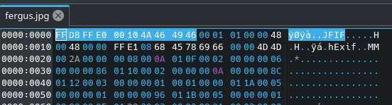
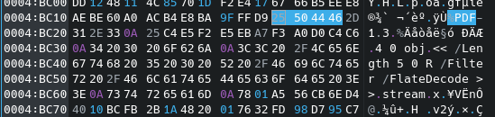
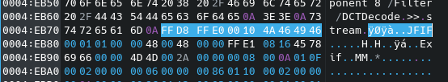

# CS 477 Assignment 4 - Stego

## Robert Detjens

---

The subject of this look into steganography is a picture of Fergus the dog.
Taking this image at face value, this image is 511KB in size, which does not
match what would be expected for an only 437x611 image. Even if tis was an
uncompressed PNG, this would be 462KB, and as a JPG this should be significantly
smaller. Something is definitely hiding in this file.

Opening this file in a hex editor, we can tell that there are multiple files in
this image. The first file is the expected JPEG, designated by the magic bytes
`JFIF`.

{ width=60% }

However, after the initial image, there are several more files, a PDF
and 2 additional JPEG images.

{ width=60% }

{ width=60% }

There are several tools that will separate files such as these, including
`binwalk` and `foremost`. For this file, `foremost` was used to pull out these
files.

```dir
output/
    audit.txt
    jpg/
        00000000.jpg
        00000629.jpg
        00000832.jpg
    pdf/
        00000606.pdf
```

\pagebreak

The extracted PDF includes the two additional images with the text "This is my
dog Fergus":

\fbox{
  \begin{minipage}{\textwidth}
    \includegraphics[width=\textwidth]{output/pdf/00000606.pdf}
  \end{minipage}
}
