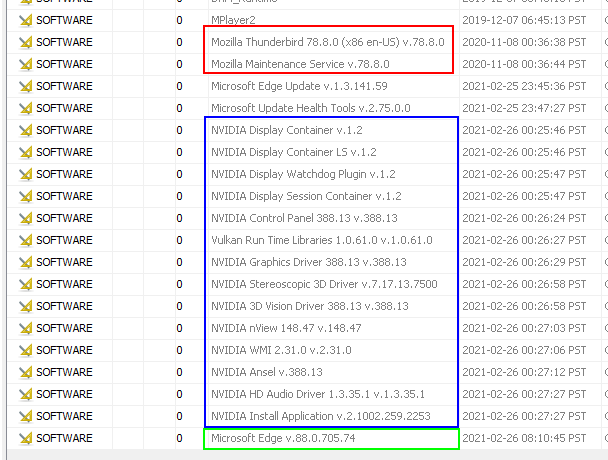

\pagebreak

# About This Report

## Qualifications

I am Robert Detjens, a student at Oregon State University. I am currently taking CS 477 Digital Forensic Analysis, which provided me with the knowledge and skills to make this Export Witness Report. I am a analyst at the Oregon Forensics Laboratory which was brought in to assist in analyzing the evidence in this case.

## Image Recovery and Details

Lake Oswego Police recovered a Dell Latitude E6440 laptop from a dumpster close to Yeats's apartment. This laptop was Yeats's work laptop at Rose City until it was decommissioned and Yeats purchased from Rose City for personal use. Fingerprints taken on the laptop by Lake Oswego PD match ones taken inside Yeats's apartment. Lake Oswego PD shut off the laptop when it was recovered.

Lake Oswego PD turned the laptop over to Portland PD, which then turned it over to the Oregon Forensics Laboratory.

The laptop had cosmetic damage when recovered; the screen and CD drive cover were cracked.

This laptop contains an internal Western Digital Caviar hard drive with serial number `WD-WMAME1526210`. This hard drive was extracted and imaged by Oregon Forensics Laboratory on March 25, 2021 at 16:23:25 using AccessData FTK Imager. This image is read-only and prevents any changes to the drive in in order to preserve the state in which the drive was recovered. I received this image for analysis and used this image to conduct all of the findings in this report.

A full list of software used to perform the analysis in this report can be found in the appendix: [Tools and Applications Used].

\pagebreak

# Analysis

## Accounts

This drive contains an installation of Microsoft Windows 10 Enterprise installed on 2020-11-19 at 08:00:21 PST.

There are 4 accounts on the system:

- `john.mccrae`
- `Ted.Roethke`
- `WiilyB`
- `yeatsw`

`john.mccrae` and `Ted.Roethke` have no modifications or personal files.

This analysis focuses on the `WillyB` and `yeatsw` accounts.

## Registry Analysis

The Windows Registry is a system-wide database that stores a large amount of data about a Windows system, including operating system settings, application data, recent files, user login information, and more. The registry is structured as a series of keys with associated values. Registry files are called "hives", and there are several different hives present on a Windows system on interest to this investigation:

- `HKEY_LOCAL_MACHINE\SYSTEM`: Stores system-level information about the operating system
- `HKEY_LOCAL_MACHINE\SOFTWARE`: Stores system-wide application configuration
- `HKEY_CURRENT_USER`: Per-user configuration, device data, and application settings

### Installed Applications

I found that this Windows install has the following non-default programs installed:

- Mozilla Thunderbird v78.8.0 (red)
- NVIDIA Driver suite v388.13 (blue)
- Microsoft Edge v88.0.705.74 (green)

{height=250px}

Additionally, the `yeatsw` user has a local install of the Tor Browser, an traffic-anonymizing version of the Firefox web browser, on their desktop: `C:\Tor Browser`.


`Tor Browser` was last launched at 2021-03-07 17:16:21 PST.


### Missing Keys

I found multiple registry entries were missing from the hive files:

- `NTCU\SOFTWARE\Microsoft\Windows\CurrentVersion\Explorer\RunMRU` for user `yeatsw`
  - Would show terminal history and programs run via the RUN dialog
- `NTCU\SOFTWARE\Microsoft\Windows\CurrentVersion\Explorer\ComDlg32` for user `WillyB`
  - Would show recently opened or saved files

## Shellbag Analysis

Shellbags are another component of the registry that records a lot of information about a specific user's history, including recently-used programs, removable drives, and files.

The shellbag for the `yeatsw` user indicates that they have knowingly interacted with the following folders:

- `C:\Program Files\Mozilla Thunderbird`
- `D:\`
- `E:\`
- `F:\`
- `Desktop\`
- `Desktop\Canada`


The shellbag for the `WiilyB` user indicates that they have knowingly interacted with the following items and folders:

- Network settings in Control Panel
- Firewall settings in Control Panel
- `C:\Windows\System32\winevt\Logs`
  - This location is where Windows stores its event logs. Users do not normally access this folder and interact with the logs via the Windows Event Viewer program.


<!-- ## File Analysis -->

<!-- ## USB Devices -->

## Web History

I recovered the browsing history from the system Microsoft Edge browser, and found the following entries:

```table
---
table-width: 1
width:
  - 0.3
  - D
markdown: true
include: supporting/webhistory.csv
---
```

[**Zentyal**](https://github.com/zentyal/zentyal) is an "small buisiness server", and provides features such as an email server and user management server.

This Zentyal server was configured as an email server and was used by the Thunderbird profile for `yeatsw` to send and receive email as `yeatsw@byzantimus.com`. This profile was originally created at 2020-11-07 17:04:50 PST.

The Zentyal server website at `byzantimus.com` was first accessed at 2020-12-07 22:01:51 PST.

The Zentyal server website was accessed again at 2021-03-07 17:21:35 PST to shut down the server (as from the `Halt or Reboot` page).

## Emails

The user `yeatsw` has the email client Mozilla Thunderbird installed. This Thunderbird installation has records of several emails between Yeats and Gonne.

3 of these emails have attached photos, discussed in [Steganography].

I extracted these emails and have included them in the Appendix in full: [Recovered Emails].

## Steganography

Steganography is the term for concealing a message within a different message. This commonly refers to hiding a file within an image in order to prevent onlookers from reading the concealed data. There are several methods of doing this, including using the lowest set of bits in an image to store data, or appending a complete file in unused space in an image file.

I analyzed the images found on the Desktop of the `yeatsw` user and images attached to the extracted emails and found the following images had hidden steganographic data:

### `mandw1.jpg`

{height=200px}

This image contained 1 hidden image:

{height=200px}

This hidden image is identical to an image located at  `C:\Users\yeatsw\Desktop\Canada\birthcert.jpg`, and there is an outwardly-identical image to `mandw1.jpg` located at `C:\Users\yeatsw\Desktop\maude&willy1.jpg`.

### `balcony.jpg`

{height=200px}

This image contained 1 hidden file identical to `C:\Users\yeatsw\Desktop\creditsuisseag.xlsx`. This spreadsheet contained the following cells:

```table
---
table-width: 1
width:
  - 0.4
  - 0.2
  - 0.2
  - 0.2
markdown: true
---
**IBAN**,**SWIFT BIC**,**Account #**,**Balance**
CH78 0055 40A1 0245 0260 1,CRESCHZZ80A,0A1024502601,"248,764.00 €"
```

This sheet contains banking information about an account with the Swiss bank Credit Suisse (Schweiz) AG.

There is an outwardly-identical image to `balcony.jpg` located at `C:\Users\yeatsw\Desktop\balcony.jpg`.

\pagebreak

# Possible Narrative

From the artifacts recovered from the analysis of the recovered laptop, it appears that Yeats and Gonne acquired fake identities and eloped to a private island in Vanuatu after smuggling $250,000 out of Byzantimus.

The first email received by Yeats in early November after setting up the fresh Windows install is from Gonne asking what has happened, and she has not heard from Yeats recently, implying that these two are at least semi-regular conversation.

The conversation moves on to taking about bonuses and how much would be "suspicious", with mentions of a property south of the equator. Yeats details that the down payment for the property will be about $200,000.

Later emails in mid- and late November from Yeats show two new Canadian passports, explained to be for Yeats and Gonne. This conversation is also when the hidden picture of the birth certificate (see [`mandw1.jpg`]) is sent to Gonne. Yeats explains to Gonne that these records are falsified and these passports were acquired under these false names. Gonne's new identity is "Mary Ellen Lee" as shown on the hidden birth certificate, and Yeats's is "John McCrae" based on the account his laptop and his allusion to Gonne being "Mrs. McCrae" in the email conversation. BOth of theme

Yeats and Gonne meet up in Seattle on December 6th to get married under their new identities, and then return back to work in separate flights over the next days.

On December 7th, Yeats tells Gonne that he will move the email server that Gonne and Yeats have been using to communicate, as shown by the first Zentyal mail server accesses in [Web History]. Gonne also sends Yeats the hidden spreadsheet (see [`balcony.jpg`]) showing the offshore Swiss bank account containing the $200,000 bonus.

Communication is quiet until March 7, 2021, when Yeats sends a final email to Gonne to confirm the money transfer and detail the plans to meet up in Mexico City or the private island. Yeats explains his plan to shut down the mail server on AWS, as shown by the Zentyal Halt page in [Web History]. Yeats discards the laptop in a dumpster where it is found by Lake Oswego PD and turned over for investigation.

\pagebreak

# Appendix

## Tools and Applications Used

```table
---
table-width: 1
width:
  - 0.4
  - 0.11
  - D
markdown: true
include: supporting/tools.csv
---
```

## Recovered Emails

!include supporting/emails.md

## Combined Abbreviated Timeline

```table
---
table-width: 1
width:
  - 0.25
  - 0.18
  - D
markdown: true
include: supporting/timeline.csv
---
```
