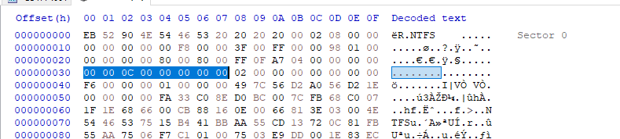
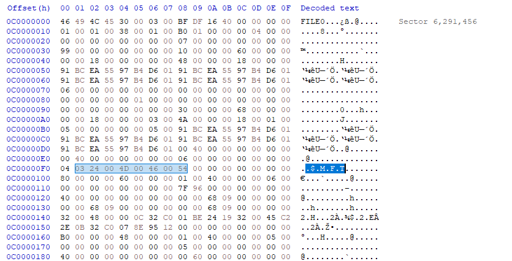

# CS 477 Assignment 1

## Robert Detjens

---

The cluster number of the MFT record is found in the boostrap area of the MBR;
specifically, `0x0030` to `0x0037`. On this image, this is `0xC0000`.

To convert this into the sector number of the MFT, we need to change this from
number of clusters to number of sectors. As there are 8 sectors in a cluster,
this is just a multiplication by 8:

$$ \texttt{0xC0000} * 8 = \texttt{0x600000} = 6291456 $$

This sector does indeed contain the MFT:

